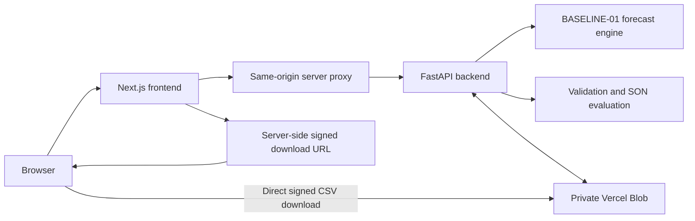

# Behavior-Aware Predictive SON

An end-to-end engineering platform for cellular traffic forecasting, validation against actual observations, and predictive network recommendations.

**Status: Production Baseline Accepted · Forecast engine: `BASELINE-01`**

[Production Demo](https://behavior-aware-predictive-son-front.vercel.app) · [Detailed Project Status](FINAL_PROJECT_STATUS.md)

## Project Overview

This project connects a recursive forecasting engine to a usable production workflow: prepare historical input, forecast cell-level demand, compare predictions with actual measurements, and evaluate explainable SON recommendations.

The public repository contains application source, tests, configuration, and required schema/KPI metadata. Production models and the private source dataset are intentionally excluded. A public clone is not a self-contained reproduction of the production ML environment.

## Data → Forecast → Validate → Decide → Act

1. **Data:** Generate a dataset with a time-based history/ground-truth split, or upload historical data.
2. **Forecast:** Run the accepted recursive engine with live progress and cell-level charts.
3. **Validate:** Match forecasts to actual observations and inspect coverage separately from prediction error.
4. **Decide:** Evaluate Energy Saving, Mobility Load Balancing, and Capacity Expansion rules.
5. **Act:** A future controlled execution layer. The application does **not** automatically apply configuration changes to a live network.

## Key Features

- Dataset Generation with live Server-Sent Events (SSE) progress.
- Anti-leak preparation: history and ground truth are separated before model-ready features are created; the latest history timestamp must precede the earliest ground-truth timestamp.
- Generated model-ready input avoids repeating full-history preprocessing. Raw uploads retain their preprocessing path.
- Recursive forecasting with preserved KPI/feature order, state updates, and RandomForest `n_jobs=1` behavior.
- Three forecasting models loaded once per generated model-ready forecast and retained throughout that run.
- Forecast SSE progress, charts, validation, and ES / MLB / CAP recommendations.
- Private artifact storage and short-lived signed URLs for direct large CSV downloads.

## Architecture



Frontend and backend run as separate Vercel projects. The same-origin frontend proxy handles protected backend access and preserves streaming progress. Credentials remain server-side. Large forecast CSV payloads are downloaded directly from Private Blob rather than relayed through a Vercel Function response.

## Forecast KPIs

| KPI | Meaning |
| --- | --- |
| `UL_PRB_UTILIZATION` | Uplink physical resource block utilization |
| `DL_PRB_UTILIZATION` | Downlink physical resource block utilization |
| `ACTIVE_USERS` | Active user demand at cell level |

The accepted 96-step horizon covers 24 hours at 15-minute intervals. Later predictions depend on the recursively updated state.

The forecast CSV contract contains five columns: `CELL_NAME`, `SDATE`, `UL_PRB_UTILIZATION_FORECAST`, `DL_PRB_UTILIZATION_FORECAST`, and `ACTIVE_USERS_FORECAST`.

## Predictive SON: ES / MLB / CAP

| Module | Current scope |
| --- | --- |
| Energy Saving (ES) | Identify qualifying low-load windows using utilization, user-count, and duration rules. |
| Mobility Load Balancing (MLB) | Identify persistent high-load conditions in the configured forecast window. |
| Capacity Expansion (CAP) | Surface sustained high-load conditions for capacity planning. |

Recommendations include triggering conditions, forecast evidence, and time windows. They support investigation and planning; they are not executed network commands. Neighbor-relation and tilt recommendations are outside the current scope. The Action Engine represents future controlled execution.

## Production Validation

The documented **100 cells × 96 steps production E2E test passed**:

| Check | Recorded result |
| --- | --- |
| Successful / failed cells | 100 / 0 |
| Forecast rows | 9,600 |
| Dataset Generation and Generation SSE | PASS |
| Forecast and Forecast SSE | PASS |
| Chart, validation, and SON smoke checks | PASS |
| Signed forecast CSV export | PASS |

Validation reports **MAE, RMSE, MAPE, and R²** on matched observations. Matching coverage answers a separate question: how much of the forecast has corresponding actual data?

One documented production run matched 9,534 of 9,600 forecast rows, approximately **99.31% coverage**. This is not a forecast accuracy percentage. Missing observations remain visible in validation reporting.

## Scale Test Results

The larger test ran in **Preview**, separately from the production smoke test.

| Measurement | Recorded result |
| --- | --- |
| Forecast workload | 2,000 cells × 96 steps — PASS |
| Successful / failed cells | 2,000 / 0 |
| Forecast rows | 192,000 |
| Forecast engine runtime | Approximately 23.74 seconds |
| Total forecast runtime | Approximately 28.70 seconds |
| Large CSV direct signed download | PASS |
| CSV size | 17,490,225 bytes, approximately 17.49 MB |

The large export check verified the expected header, row count, and file size. These are reference test results, not latency guarantees, concurrency benchmarks, or claims of universal model accuracy. See [FINAL_PROJECT_STATUS.md](FINAL_PROJECT_STATUS.md) for the recorded baseline.

## Tech Stack

- **Frontend:** Next.js, React, TypeScript, CSS/Tailwind tooling.
- **Backend:** Python, FastAPI, Uvicorn.
- **ML and data:** scikit-learn, RandomForest, clustering models, pandas, NumPy, joblib.
- **Infrastructure:** Vercel, Private Vercel Blob, SSE, same-origin proxy, signed downloads.

Dependency versions are recorded in `requirements.txt` and the frontend package files. Model/runtime compatibility should be validated before changing dependency versions; the accepted baseline documented non-blocking scikit-learn version and KMeans feature-name warnings.

## Repository Structure

```text
api/                         FastAPI entry point and routes
backend/app/services/        Generation, forecast, chart, validation, SON services
frontend_candidate/          Next.js application and frontend regression tests
ml_engine/                   BASELINE-01 engine
models/forecasting/          Placeholder only; private artifacts excluded
models/clustering/           Placeholder only; private artifacts excluded
data/processed/              Required schema and KPI mapping metadata
tests/                       Backend regression tests
requirements.txt             Python dependencies
vercel.json                  Backend Vercel configuration
FINAL_PROJECT_STATUS.md      Recorded acceptance results
```

## Local Development

Use the Python version specified in `.python-version` and a Node.js version compatible with the pinned Next.js release.

### Frontend

```bash
cd frontend_candidate
npm ci
npm run dev
```

Open `http://localhost:3000`. Configure a local, ignored environment file using `.env.example` as a template and point it to your own authorized backend. A full workflow also requires privately provisioned models, data, and storage configuration. Never expose storage or backend-access credentials through public client environment variables.

Build the frontend with:

```bash
npm run build
```

### Backend

From the repository root:

```bash
python -m venv .venv
# Activate the virtual environment using your shell's activation command.
python -m pip install -r requirements.txt
python -m uvicorn api.index:app --reload --port 8000
```

Starting the API does not provision the missing production artifacts. Forecasting, generation, and Blob-backed operations require an independently configured private environment. Preserve the supplied schema/KPI metadata and use compatible, trusted model artifacts; joblib files should not be loaded from untrusted sources.

## Important Note About Models & Private Dataset

**Production model artifacts are intentionally not included in the public repository.** This covers both forecasting and clustering `.joblib` files. Only directory placeholders are included; Git LFS is not used.

The private source dataset is also absent from the public repository. Generated datasets, model outputs, local environment files, credentials, and Vercel linkage files are excluded from version control.

The existing production Vercel environment provisions these resources separately. Cloning or deploying this public repository alone does not recreate that environment or provide access to its private artifacts.

## Production Demo

[Open the production application](https://behavior-aware-predictive-son-front.vercel.app)

Explore Home, Forecast, Test & Validation, SON Recommendations, and the future Action Engine scope. The documented acceptance results describe specific completed tests; current availability and execution time depend on the running environment.

## Project Status

**Production Baseline Accepted.** `BASELINE-01`, the recursive forecast behavior, and the CSV contract were preserved through production finalization.

The accepted scope includes generation, forecasting, SSE progress, charting, validation, predictive SON recommendations, and signed private CSV export. Broader model evaluation, monitoring, and controlled network execution remain future work.
